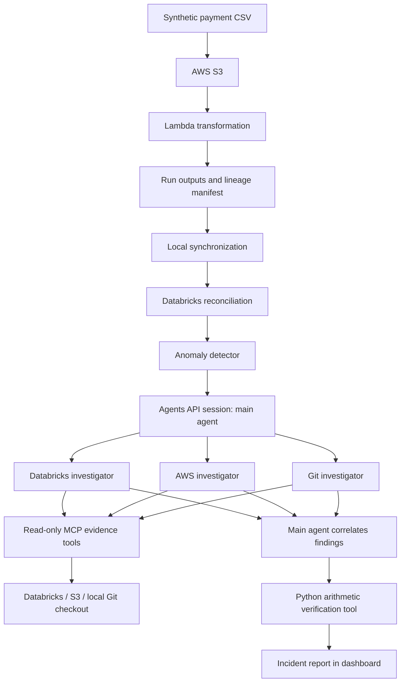

# Payment incident investigator

**A dashboard flags an unexpected revenue drop. Three AI investigators trace the numbers, the pipeline and the code change, then a main agent combines their evidence into an incident report.**

If you work with data, the starting point is familiar: a chart looks wrong, and you need to establish why before explaining it. This project explores automating that investigation across systems using the OpenAI Agents API and read-only MCP tools.

This is a working demonstration with synthetic payments and an intentionally introduced transformation defect. It does not process real customer payments or execute repairs.

## The incident

The pipeline produces its expected files and row counts, but a code change divides card provider v2 amounts by 100. Values already expressed in cents are scaled down incorrectly.

| Affected cohort | Expected revenue | Reported revenue | Understatement |
| --- | ---: | ---: | ---: |
| 238 successful card v2 payments | SGD 19,088.26 | SGD 190.90 | **SGD 18,897.36** |

Card v1 and wallet v1 remain reconciled. A technically completed pipeline can still produce financially incorrect reporting.

**The default branch retains the deliberate defect in `app/transform.py`.** Use the `healthy-reconciliation-baseline` tag to inspect the healthy implementation and `incident-card-v2-bug` to inspect the incident. The healthy local pipeline check is expected to fail against the incident implementation.

## How the investigation works



| Agent | Question it investigates | Evidence |
| --- | --- | --- |
| Databricks investigator | Which payments and cohorts disagree with the source records? | Expected and reported amounts, mismatch counts and run lineage |
| AWS investigator | What artifacts did this exact pipeline run publish? | S3 run manifest and output metadata |
| Git investigator | What changed in the deployed code? | Recorded commit compared with the healthy tag in a local checkout of the GitHub repository |
| Main agent | Do these findings describe the same incident, and what do they establish? | Matching run IDs and commit SHAs, investigator findings and Python verification |

The main agent starts three investigators. Databricks begins with a payment-method comparison and chooses a provider-version breakdown or samples based on what it finds. Git first lists changed files. The main agent then passes the affected cohort to the existing Git investigator for a focused code review, before calling `verify_financial_impact(run_id)` itself. Missing or conflicting evidence must be reported explicitly.

The dashboard shows the actual sequence of evidence requests and findings. A persistent, per-run tool-call ceiling bounds evidence access. See [adaptive investigation and live acceptance checks](docs/adaptive-investigation.md).

MCP exposes the evidence functions. The Agents API runs the coordinated agent investigation. The underlying SQL, S3 reads and Git commands remain ordinary application code.

## How the Agents API reduced the work

This workflow could also be built using individual model calls and a custom orchestrator. The benefit here was having less orchestration infrastructure to implement and debug, leaving more time for reconciliation, evidence quality and the demo itself. No measured development-time speedup is claimed.

| Concern | With individual model calls and a custom orchestrator | What this project uses |
| --- | --- | --- |
| Delegation | Implement investigator execution and route tasks and findings | A managed session with multi-agent execution enabled |
| Model/tool cycles | Dispatch requested tools and feed their results back into model conversations | A service-connected MCP tool configuration |
| Progress | Define and connect execution events across workers | Stream session events into a local trace and display investigator starts |
| Stored output | Build storage and retrieval for model conversation items | Retrieve the completed final message by session ID |

The actual configuration in [scripts/run_agents.py](scripts/run_agents.py) includes:

```python
"multi_agent": {
    "enabled": True,
    "max_concurrent_subagents": 3,
},
```

The concurrency setting caps simultaneous subagents; the instructions request exactly three investigators and define their responsibilities. It is not a hard-coded three-worker scheduler.

The same session configuration attaches the evidence server:

```python
"tools": [{
    "type": "mcp",
    "server_label": "payment_evidence",
    "transport": {
        "type": "http",
        "server_url": setting("MCP_PUBLIC_URL"),
    },
    "connection_origin": "service",
    "required": True,
    "allowed_tools": sorted(TOOLS),
}],
```

These are excerpts, not standalone scripts. See the complete `client.beta.agents.sessions.create(...)` call in the source and the [official session API reference](https://developers.openai.com/api/reference/python/resources/beta/subresources/agents/subresources/sessions/methods/create).

### A concrete debugging benefit

During development, an investigation completed and printed its report, but the local report-saving code looked for the wrong message phase. The completed answer was available in the saved session as `final_answer`. It could be retrieved without launching the three investigations again:

```python
for item in client.beta.agents.sessions.items.list(
    session_id, order="asc", limit=100
):
    # Select the completed assistant message with phase="final_answer".
    ...
```

This demonstrates recovery of already completed output. It does not establish automatic recovery from every execution failure.

### What I still built

The API does not supply the payment pipeline, reconciliation rules, evidence tools, anomaly detector or dashboard. Application code also validates alert identifiers, records local state and redacted events, and atomically claims one investigation attempt per run. Automatic session-creation retries are disabled; failed attempts are retained for inspection.

## Why AWS and Databricks?

**AWS runs the operational pipeline.** S3 stores inputs and per-run outputs; Lambda transforms payments. The manifest links an output to its source and deployed commit. This gives the investigation evidence about where the reported numbers came from.

**Databricks performs analytical reconciliation.** It brings source and processed records together, compares expected with reported amounts, and aggregates discrepancies by cohort and hour. It provides the financial checks that output files and row counts alone cannot establish.

Databricks is a design choice, not a requirement for all such systems: reconciliation could be implemented using AWS analytics services or another database. Using separate systems makes this demo a useful exercise in correlating operational, analytical and code evidence.

## Repository guide

| File | Purpose |
| --- | --- |
| `app/transform.py` | Payment transformation, including the intentional incident defect |
| `app/lambda_handler.py` | S3 input processing, output artifacts and run manifest |
| `scripts/generate_payments.py` | Reproducible synthetic payments and baseline totals |
| `scripts/run_local_pipeline.py` | Local transformation and healthy-baseline checks |
| `scripts/sync_pipeline.py` | Download new run artifacts and invoke the Databricks loader |
| `scripts/load_databricks.py` | Load records, create reconciliation tables and current-run views |
| `scripts/detect_anomaly.py` | Six-hour trend and reconciliation checks |
| `scripts/evidence_mcp.py` | Four read-only, run-scoped evidence tools with selectable drill-downs |
| `scripts/investigation_steps.py` | Evidence summaries, persistent call budget and dashboard trail |
| `scripts/run_agents.py` | Managed session, investigator instructions, events and report storage |
| `scripts/watch_incidents.py` | Poll, synchronize, detect and investigate |
| `scripts/dashboard_api.py` | FastAPI dashboard endpoints |
| `dashboard/index.html` | Revenue chart, alert and investigation report UI |

## Running the project

See [the setup guide](docs/setup.md). This repository contains application code; it does not yet provision AWS or Databricks infrastructure automatically. The full demo needs configured cloud resources and Agents API access. The synthetic data generator runs without cloud credentials.

The demo was developed on Ubuntu with Python 3.12. AWS, Databricks and API usage depend on account allowances and may incur charges. The project does not guarantee a zero-cost run.

## Evidence boundaries

- All payments are synthetic. Provider records are the reconciliation baseline; actual customer charges are not independently verified.
- Python verification recalculates arithmetic from the same Databricks rows. It is not an independent source-file audit.
- S3 output publication alone does not prove CloudWatch execution status or retry history.
- Git evidence comes from a local repository checkout, not a live GitHub API call.
- The detector uses a six-hour window; investigation tools can return full-run totals. Reports must distinguish them.
- Instructions guide the agent's reasoning; fixed read-only tools constrain available operations. The system recommends remediation but does not execute it.
- This is a single-host demo. Local attempt directories prevent duplicate starts on that host, not globally across multiple deployments.
